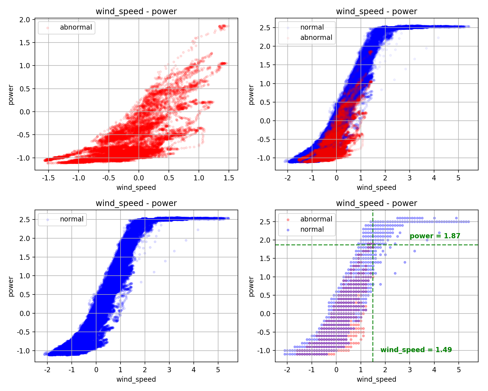
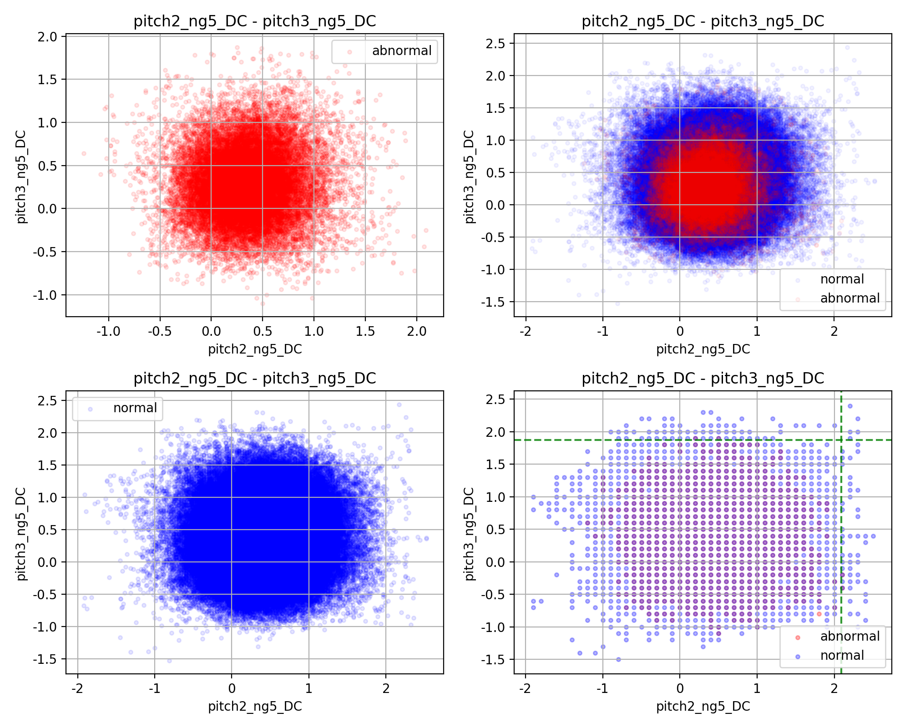
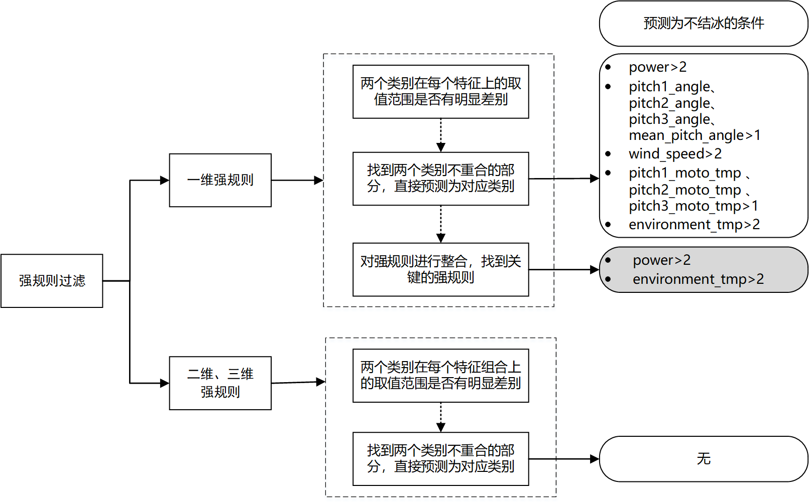
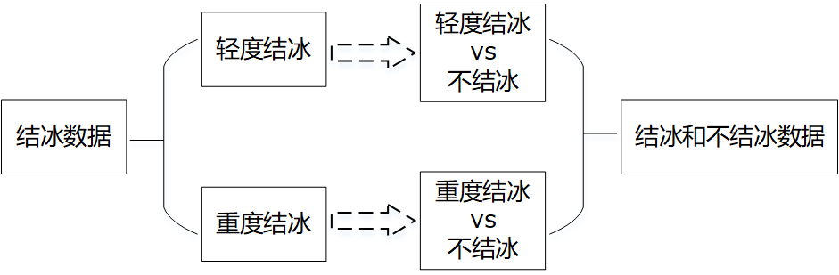
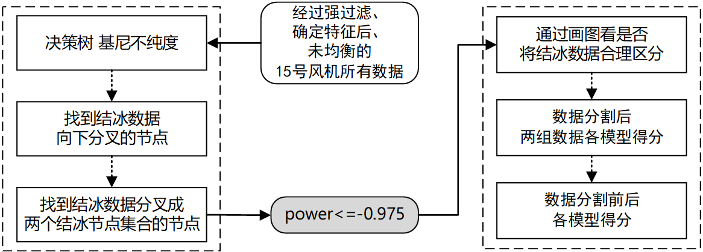
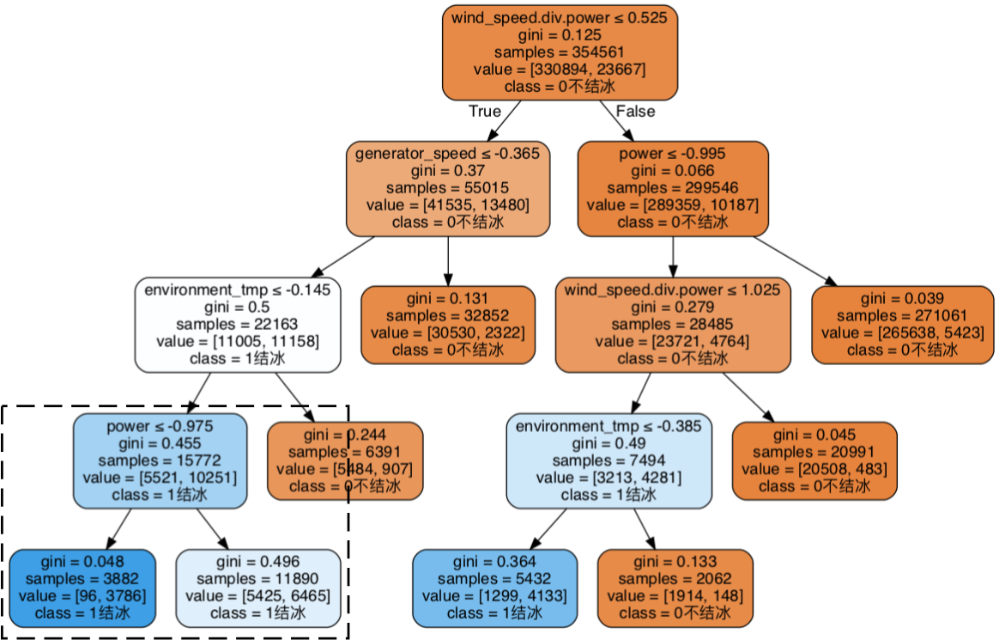
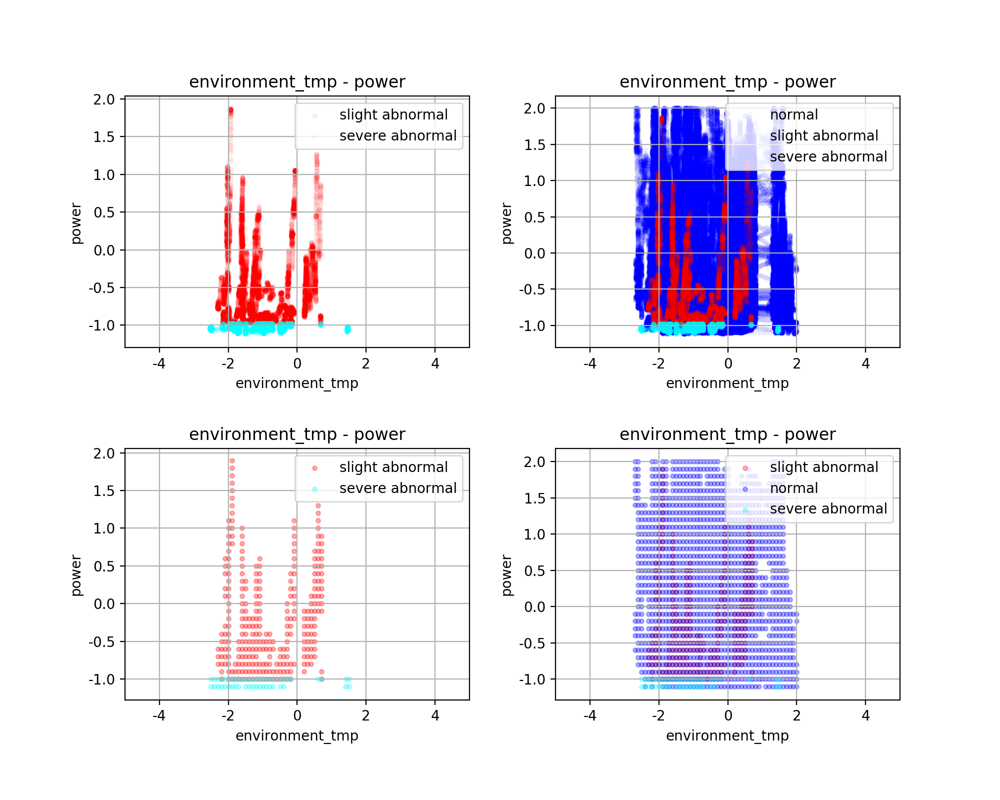
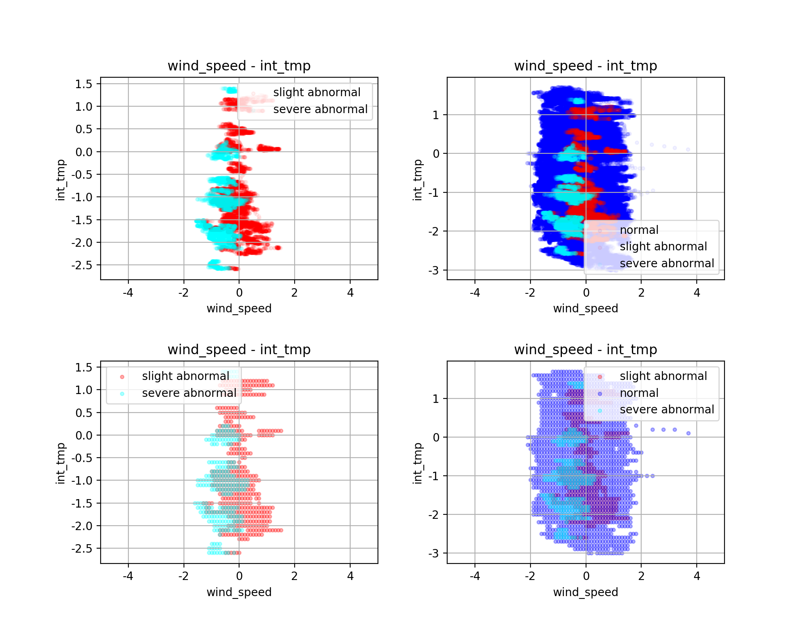

## 风机结冰预测 之 强规则过滤和数据分割

### 简介

#### 1  项目结构

```shell
├── data（数据预处理、特征工程之后得到的数据）
│   ├── 15-new.csv
│   ├── 15.csv
│   ├── 1521-new.csv
│   ├── 15_under.csv
│   ├── 21-new.csv
│   └── 21.csv
├── model
│   ├── gen_data.ipynb（用于生成交给后面模型调优的数据的代码）
│   ├── model.ipynb（测试模型的代码）
│   ├── rule（寻找强规则过程中产生的图片的文件夹）
│   │   ├── acc_x-acc_y_False.png
│   │   └── ......
│   ├── rule.ipynb（寻找强规则的代码）
│   ├── split（寻找数据分割方法过程中产生的图片的文件夹）
│   │   ├── 3label_environment_tmp-int_tmp_False.png
│   │   └── ......
│   └── split.ipynb（寻找数据分割方法的代码）
└── result（交给后面模型调优的数据）
    ├── 15.csv（15号风机的数据）
    ├── 15_under.csv（欠采样后的15号风机的数据）
    └── 21.csv（21号风机的数据）
```

其中`rule.ipynb`是寻找强规则的代码，`split.ipynb`是寻找数据分割方法的代码。


#### 2  问题背景

[风机结冰数据](http://www.industrial-bigdata.com/pages/datadown/dataset/dataSet06.jsp?index=2)

[风机叶片结冰预测大赛](http://industrial-bigdata.com/competition/competitionAction!showDetail.action?competition.competitionId=1)


### 第4章 强规则过滤和数据分割

前面已经进行了数据探索和预处理，并进行特征工程选出和生成了一些特征，那么这章我们进行强规则过滤和数据分割，从而为最终模型的建立打好基础。因为判断强规则过滤和数据分割的效果时，我们的依据主要是比较修改前后的模型得分，所以中间穿插了数据均衡处理和确定特征的部分，来帮助建立早期的模型，让用于比较的得分有意义。

我们将在这部分对计算方案进行详细介绍，包括设计思路、实现过程和最终结果，我们还会简单地分析除了最终采用方案以外的其他方案的结果和利弊，希望对也准备使用这些方法的人们有所帮助。

因为我们组实验设计流程是对15号风机按照7:3的比例划分训练集和验证集，通过验证集的表现来调整训练集建立的模型，然后将21号风机作为测试集，用来查看盲测效果，所以本章使用的数据只有15号风机的373696条数据。

 

#### 4.1 强规则过滤

强规则过滤的目的是将一些显而易见的数据样本直接划分出来，并预测为某类，这样可以一开始有个简单的基于规则阈值的分类器，也可以帮助剩下的难分类的数据用更复杂的模型学到更好的效果。

那么借助可视化的数据探索，我们计划寻找一维强规则和二维、三维强规则，再高维我们就不方便借助图形来查看了。我们在15号风机的373696条数据上寻找强规则，查看特征尽可能多，所以包括了26个原始特征和新生成的5个特征。

一维强规则就是形如power>2的规则，见图1。我们做了很多类似的图形来帮助寻找强规则，以图1为例，两个特征wind_speed和power分别是x和y轴，左上角的图是结冰数据，左下角的图是非结冰数据，右上角的图是将结冰数据和非结冰数据绘制在一张图上，点的某个颜色越深说明在这个位置这个颜色的点的个数越多。右下角的图也是将结冰数据和非结冰数据绘制在一张图上，但是和右上角的图不同，因为右上角的图看不出红色点堆叠处下面是否有蓝点，所以在右下角，我们将点的含义变成存在结冰数据就有红点、存在非结冰数据就有蓝点，而不让蓝点和蓝点、红点和红点堆叠，方便看清红点和蓝点的重叠情况，并且用绿色线标出了范围更小的那类先达到的边界值，如图1表达的强规则就是wind_speed>1.49或者power>1.87判定为不结冰，但因为这只是在15号风机上找出的规则，为了在其他风机上强规则也奏效，我们适当调整阈值，如power>1.87变为power>2。

 



<center>图1 wind_speed—power</center>

 

一维强规则的具体寻找步骤是：第一步，先对每个特征分两个类别进行查看，对两个类别中先达到边界的那个类的边界值向上取整，作为初始阈值，从而查看初始阈值条件下可筛选个数。然后我们发现筛选个数在1000的特征有不少，所以第二步再次查看这些筛选个数较多的规则，并根据数据范围重新调整阈值，第二步最终的结果在表1中。最后，第三步看不同强规则是不是筛出的数据点实际上是同一批，然后找出关键强规则，即用较少强规则就能筛出绝大部分数据点。我们发现表1中所有规则放一起能筛选出的数据是19180条，而只用power>2和environment_tmp>2这两条规则就能筛选出19136条数据，所以我们将这两条规则作为最终的强规则，数据的power>2或者environment_tmp>2就判定为不结冰。


 <center>表1 筛选个数超过1000的强规则</center>

| 特征                  | 真实阈值 | 设置阈值 | 过滤数目 |
| --------------------- | -------- | -------- | -------- |
| power                 | 1.87     | 2        | 16581    |
| wind_speed            | 1.49     | 2        | 11503    |
| environment_tmp       | 1.47     | 2        | 2555     |
| pitch1/2/3_moto_tmp   | 0.36     | 1        | 10871    |
| pitch1/2/3/mean_angle | 0.45     | 1        | 12530    |

 

二维强规则是形如$\left(p i t c h 2_{-} n g 5_{-} D C-0.4\right)^{2}+\left(p i t c h 3_{-} n g 5_{-} D C-0.5\right)^{2}=1.5^{2}$的规则，见图2，图2中各标记的含义同图1。我们观察发现图形能发现的二维强规则较少，而且不容易确定数字公式形式，比如图2中并不是标准的圆，最重要的是筛选出的数据点少，远少于1000条，所以我们决定不在二维和三维强规则上继续探究，规则难找还筛选个数少、作用小。




<center>图2 pitch2_ng5_DC—pitch3_ng5_DC</center>

 

图3是上述强规则过滤的完整流程总结，灰色背景的方框内是最终我们采用的强规则。

 



<center>图3 强规则过滤流程</center>

 

强规则过滤的效果我们容易预计，只要21号风机和15号风机差别不大，那么强规则过滤部分的分类正确应该是接近100%的。但是接下来要进行的数据分割的效果不能这样直接看出，不同的分割方法可能效果不同，所以我们需要借助模型得分来判断。为了保证得分的正确性，我们需要做数据均衡；为了保证与最终调优后模型得分较为接近，我们需要确定模型使用的特征。所以接下来的两节，我们先介绍数据均衡和特征选择。

 

#### 4.2 数据均衡

15号风机样本数是373696条，其中不结冰有350029条，结冰有23667条，不结冰与结冰的比例大约是14.8:1，结冰数据占比太低。考虑到强规则过滤是得到一些直接预测为结冰数据的样本点，所以也减轻了不均衡的程度，那么接下来我们在15号风机过滤后的数据上来寻找数据分割点。15号风机过滤后的样本数是354561条，其中不结冰有330894条，结冰有23667条，不结冰与结冰的比例大约是14.0:1，结冰数据依然占比低，还是需要做数据均衡。

常见的数据均衡方法有三种，第一种是在模型中增加对正负样本的惩罚权重，第二种是欠采样，第三种是过采样，我们对三种方法分别进行实验，通过比较均衡前后各指标得分差来分析效果，并确定采用哪种方案。本次数据均衡实验使用的特征还是26个原始特征和新生成的5个特征，因为还未进行特征选择。数据均衡的实验结果在表2中，我们希望经过数据均衡Accuracy得分能够降低，AUC得分能够升高，表2中标粗的部分是Accuracy得分降低，AUC得分升高的值。我们发现欠采样和过采样效果各有侧重，又考虑到目前的得分都较高（见表3），所以为了之后的实验能够有提升空间，如经过试验调优AUC能够升高，所以我们最终选择欠采样的数据均衡方法。

 

<center>表2 三种方法均衡前后各模型得分差</center>

| 数据均衡方法 | 模型                | **Accuracy** | Precision | Recall | **AUC**   |
| ------------ | ------------------- | ------------ | --------- | ------ | --------- |
| 惩罚权重     | Nearest Neighbors   | /            | /         | /      | /         |
|              | Logistic Regression | **-0.07**    | -0.369    | 0.39   | **0.143** |
|              | Decision Tree       | 0            | 0.002     | 0.001  | **0.001** |
| 欠采样       | Nearest Neighbors   | **-0.033**   | -0.034    | 0.04   | -0.011    |
|              | Logistic Regression | **-0.089**   | 0.157     | 0.401  | **0.143** |
|              | Decision Tree       | **-0.006**   | -0.002    | 0.001  | -0.003    |
| 过采样       | Nearest Neighbors   | 0            | 0.018     | 0.053  | **0.023** |
|              | Logistic Regression | **-0.091**   | 0.168     | 0.384  | **0.141** |
|              | Decision Tree       | 0            | 0.005     | 0.006  | **0.002** |

注：“/”表示没有进行试验，因为Nearest Neighbors没有可以直接设置正负样本惩罚权重参数

 

<center>表3 均衡前的各模型得分</center>

|                     | Accuracy | Precision | Recall | AUC   |
| ------------------- | -------- | --------- | ------ | ----- |
| Nearest Neighbors   | 0.995    | 0.974     | 0.947  | 0.972 |
| Logistic Regression | 0.951    | 0.712     | 0.449  | 0.718 |
| Decision Tree       | 0.999    | 0.994     | 0.994  | 0.997 |

 

那么接下来的特征确定和数据分割点寻找就在15号风机经过强规则过滤和欠采样处理后的数据上进行，总样本数是47334条，其中结冰和不结冰数据各23667条，比例是1:1。

 

#### 4.3 特征选择

在之前的特征选择章节中，我们从原始的26个特征中选出了12个特征，生成了5个新特征，我们认为新生成的特征含义重要，应该必须使用，但是不确定选出的12个特征究竟效果如何，所以在15号风机经过强规则过滤和欠采样处理后的数据上按照7:3划分训练集和测试集，看使用不同特征组合后得分的区别。我们设置了两个特征组，组一是使用原始26个特征和生成的5个特征，组二是使用选出的12个特征和生成的5个特征，两组在各模型上的得分如表4所示，我们发现组一在Accuracy指标上得分过高，且各模型得分差距较大，而组二在各模型、各指标上得分稳定较高。所以，我们认为组二的特征组合更好，选用筛选出的12个特征和生成的5个特征作为我们的特征。

 

<center>表4 两个特征组的各模型得分</center>

| 特征组         | 模型                | Accuracy  | Precision | Recall    | AUC       |
| -------------- | ------------------- | --------- | --------- | --------- | --------- |
| 组一  （26+5） | Nearest Neighbors   | **0.993** | **0.959** | 0.94      | **0.969** |
|                | Logistic Regression | **0.95**  | 0.727     | 0.424     | 0.706     |
|                | Decision Tree       | **0.999** | **0.996** | 0.994     | **0.997** |
| 组二  （12+5） | Nearest Neighbors   | 0.966     | 0.953     | **0.981** | 0.966     |
|                | Logistic Regression | 0.848     | **0.871** | **0.816** | **0.848** |
|                | Decision Tree       | 0.994     | 0.994     | **0.995** | 0.994     |

 

#### 4.4 数据分割

我们进行数据分割是因为一个模型不能涵盖不同的情况，我们希望不同结冰原因导致的结冰数据能对应不同的模型，这样总的分类效果能更好。结合图4，我们来介绍这部分数据分割的思路。我们暂时不看不结冰数据，只关注结冰数据，希望能找到某个分割规则将结冰数据分为两类，比如一类是轻度结冰，另一类是重度结冰，然后在总数据上根据这个分割规则，将总数据分为两个数据，一个是包括轻度结冰和部分不结冰数据，另一个包括重度结冰和剩下的不结冰数据。然后根据对这两个部分的数据分别建立分类模型并求解。

 



<center>图4 数据分割思路</center>

 

结合图5，我们来说明具体的实验过程，我们在经过强过滤、确定特征后的15号风机数据上查找分割规则，考虑到欠采样对数据分布有影响，所以在寻找时用的还是未均衡的数据，共354561条，其中不结冰有330894条，结冰有23667条。借助决策树模型树分裂的特点，通过控制叶节点个数，找到早期的结冰节点结合分裂为两种结冰节点的模式，如图6所示，这次树分裂的规则是power<=-0.975，所以这就是我们找出的数据分割规则，我们称结冰数据中power<=-0.975的为重度结冰，power>-0.975的为轻度结冰。

 



<center>图5 寻找数据分割规则的流程</center>

 



<center>图6 数据分割实验过程</center>

 

找出的分割规则，我们还需要进行分析验证，这部分主要通过画图来观察。首先我们在不同特征上绘制354561条样本点，其中不结冰有330894条，结冰的23667条样本又分为14467条轻度结冰和9200条重度结冰。如图6所示，左边的两幅图是23667条结冰数据内部分类的绘制，红色是轻度结冰，浅蓝色是重度结冰，左上角图中点的某个颜色越深说明在这个位置这个颜色的点的个数越多，而左下角的图同一颜色的点在一个位置只会出现一次，不会出现同种颜色点的堆叠，只会出现不同颜色点的堆叠，方便看出浅蓝色点下是否有红色点。右边的两幅图是所有354561条样本点的绘制，分为三类，深蓝色是不结冰数据。我们从图7就容易发现，power<=-0.975对结冰数据还是有一定区分度的，尤其是左下角图的最下方的一层浅蓝色点下面并没有红色点，说明这两种结冰数据在power这个维度的确有区别，但是在右下角图中该位置下面却有深蓝色点，说明这两种结冰数据在与不结冰数据区分时有不同，也就是说可能学到的分类规则不同。



<center>图7 environment_tmp—power</center>

 

我们也在wind_speed这个特征维度发现按照power<=-0.975分割的结冰数据的确有区分，见图8，图8中各标记含义同图7。



<center>图8 wind_speed—int_tmp</center>

 

下面我们在欠采样后的数据集上进行得分实验，实验结果在表5中，15号风机经过强过滤、特征确定和欠采样后，总样本数是47334条，其中结冰和不结冰数据各23667条。其中，power<=-0.975（重度结冰vs结冰）中结冰样本数：不结冰样本数=9200：2222，power>-0.975（轻度结冰vs结冰）中结冰样本数：不结冰样本数=14467：21445。从实验结果我们可以看出，分割后的两组数据模型得分差距较大，尤其是power<=-0.975组用不同模型得分差别很大，还需要认真选择模型和调优，学到真正的规则，我们在接下来的章节介绍。

 

<center>表5 数据分割后两组数据上各模型得分</center>

|               | 模型                | Accuracy | Precision | Recall | AUC   |
| ------------- | ------------------- | -------- | --------- | ------ | ----- |
| power<=-0.975 | Nearest Neighbors   | 0.955    | 0.928     | 0.964  | 0.957 |
|               | Logistic Regression | 0.855    | 0.862     | 0.763  | 0.84  |
|               | Decision Tree       | 0.996    | 0.993     | 0.998  | 0.996 |
| power>-0.975  | Nearest Neighbors   | 0.996    | 0.995     | 1      | 0.989 |
|               | Logistic Regression | 0.957    | 0.966     | 0.982  | 0.916 |
|               | Decision Tree       | 0.994    | 0.996     | 0.997  | 0.989 |

 

我们还查看采用数据分割前后的效果，如表6所示。其中分割后一类中我们暂时没做不同类型模型的组合，而是让分割后的两组数据使用同一类模型，只不过学到的模型参数有所不同。表6中标粗的数字表示是该模型在该指标下的最高得分，比如分割前的模型为Nearest Neighbors的Accuracy数值0.966标粗是因为0.966>0.965（分割后的模型为Nearest Neighbors的Accuracy数值）。可以看到，整体是分割后得分更高，标粗的数字更多。我们也可以理解，因为数据划分越细，模型学的越有针对性，效果应该会变好。

 

<center>表6 数据分割前后各模型得分</center>

|        | 模型                | Accuracy  | Precision | Recall    | AUC       |
| ------ | ------------------- | --------- | --------- | --------- | --------- |
| 分割前 | Nearest Neighbors   | **0.966** | 0.953     | **0.981** | **0.966** |
|        | Logistic Regression | 0.848     | 0.871     | 0.816     | 0.848     |
|        | Decision Tree       | 0.994     | 0.994     | 0.995     | 0.994     |
| 分割后 | Nearest Neighbors   | 0.965     | **0.954** | 0.978     | 0.965     |
|        | Logistic Regression | **0.879** | **0.904** | **0.849** | **0.879** |
|        | Decision Tree       | **0.996** | **0.994** | **0.998** | **0.996** |

 

综合本节的分析，我们确定了数据分割点为power<=-0.975，并通过画图观察数据点分布验证分割出的两组数据差别较大，然后通过查看数据分割后两组数据上各模型得分，以及数据分割前后各模型得分，进一步验证分割是有效果的。

 

#### 4.5 本章小结

这章我们使用15号风机的数据，找到两条强规则，样本的power>2或者environment_tmp>2就判定为不结冰。然后确定我们的数据均衡使用欠采样，确定使用筛选出的12个特征和生成的5个特征作为我们的特征。最后，在经过了强规则过滤和确定了的特征下寻找数据分割点为power<=-0.975，并在欠采样后的数据上查看得分，确定接下来的模型调优方向。
